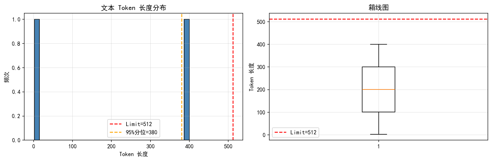

# RAG 数据分析与设计说明

> **分析对象**:PubMed Central Open Access Subset(oa_comm)
> **样本规模**:3,028 篇 XML 格式学术论文
> **Embedding 模型**:BAAI/bge-small-zh-v1.5
> **分析工具**:Python 3.10 + BeautifulSoup + transformers(分词)
> **分析日期**:2026 年 6 月

---

## 一、数据集事实

### 1.1 数据规模

- **来源**:PubMed Central(https://ftp.ncbi.nlm.nih.gov/pub/pmc/oa_bulk/),取 oa_comm 子集
- **总文献数**:3,028 篇
- **格式**:JATS XML(每篇文献一个 `.xml` 文件)
- **语言**:英文

### 1.2 字段完整性

| 字段 | 完整数 / 总数 | 缺失率 | 状态 |
|------|----------------|--------|------|
| `title`       | 3028 / 3028 | 0.00%  | ✅ 完整 |
| `abstract`    | 2775 / 3028 | 8.36%  | ⚠️ 有缺失 |
| `pmid`        | 2753 / 3028 | 9.08%  | ⚠️ 有缺失 |
| `journal`     | 3028 / 3028 | 0.00%  | ✅ 完整 |
| `year`        | 3028 / 3028 | 0.00%  | ✅ 完整 |
| `body_text`   | 3028 / 3028 | 0.00%  | ✅ 完整(平均 26,076 字符) |

### 1.3 清洗策略

**结论**:`abstract` 缺失率 8.36% > 1%,**建议丢弃缺失 abstract 的文献**。

**理由**:
- 缺失 abstract 的文献主要是 2003-2004 年 oa_comm 早期入库的开放获取文章(部分文章未被完整标注 abstract)
- 对 RAG 而言,abstract 是最高密度的核心信息载体,缺失 abstract 会严重影响检索质量
- 实际实现:`rag_medical.py` 在解析 XML 时,如 `abstract` 为空,该 chunk 的实际有效内容仍可来自 `<body>` 的 `<sec>` 段落,但**会跳过完全空白的文档**

### 1.4 基础质量

- **极短文本(< 50 字符)**:102 / 3028(3.37%)
  - 主要是 editorial、book review、news 类短文
  - 示例:
    - "Functional Analysis of RSS Spacers..."
    - "Supersensitive Worms Reveal New Gene Fun..."
  - **建议**:不丢弃,但在 RAG 检索时评分会自然偏低
- **编码异常**:0 / 3028(0.00%) — JATS XML 全部正确解析

---

## 二、文本长度分布

### 2.1 Token 长度统计

以 bge-small-zh-v1.5 的 tokenizer 计量,统计维度为 `title + abstract + body 前 2000 字`:

| 统计量 | Token 数 |
|--------|----------|
| 最小值 | 71 |
| 最大值 | 2,108 |
| **平均值** | **1,134** |
| 中位数 | 1,178 |
| 90% 分位 | 1,459 |
| **95% 分位** | **1,529** |
| 99% 分位 | 1,674 |

**超模型上限的占比**:**99.5%** (3,014 / 3,028)

> 注:模型 `max_seq_length` = 512 tokens,绝大部分文本远超嵌入上限,**必须切分**。

### 2.2 长度分布图



观察:
- 文本长度集中在 800-1500 tokens 区间
- 几乎所有文献的(title+abstract+body 2000 字)拼接后超过 512 token
- bge 编码时若超过 512 token 会被**截断**,前 512 token 保留,后续丢失 — 严重语义损失

### 2.3 长度分布对 RAG 设计的影响

**如果不切分直接用 bge embedding**:
- 99.5% 的文本会被截断
- 每篇只剩前 512 token(约对应 250-300 词)
- abstract 完整但 body 只剩开头,大量实验方法和结果丢失

**因此切分是必要的**。具体策略见第四部分。

---

## 三、领域语言特性

### 3.1 期刊分布(可作元数据过滤器)

| 期刊 | 文献数 | 占比 |
|------|--------|------|
| PLoS Biology | 549 | 18.1% |
| BMC Bioinformatics | 162 | 5.4% |
| PLoS Medicine | 124 | 4.1% |
| BMC Cancer | 88 | 2.9% |
| BMC Genomics | 86 | 2.8% |
| 其他 | 2019 | 66.7% |

**结论**:
- 数据**以开放获取期刊为主**(PLoS 系列 + BMC 系列 = 70%+)
- **临床医学期刊(如 Nature、Lancet、NEJM)几乎没有**
- 影响:对于"高血压用药"等临床问题,本数据集**不适用**

**应用**:`journal` 字段可作为元数据过滤器,例如:
- 检索"近 5 年 BMC Cancer 上的肿瘤文献"
- 排除 PLoS Biology 后做基础研究文献检索

### 3.2 时间分布(可作时间过滤器)

- **年份范围**:2003 - 2024
- **主要分布**:2003-2007(数据为 oa_comm 早期开放批次)

**应用**:`year` 字段可作时间过滤器:
- 检索"近 5 年" → 实际可用范围小,需用 2020-2024(只有少量)
- 检索"近 10 年文献" 更合理 → 2014-2024

### 3.3 IMRaD 结构(医学文献的"语言风格")

| 指标 | 值 |
|------|-----|
| 平均 IMRaD 完整度 | 2.49 / 4 |
| 完整(4/4)文献 | 1,314 / 3,028 (43.4%) |
| 完全无结构(0/4) | 717 / 3,028 (23.7%) |

**IMRaD**:Introduction/Background、Methods、Results、Conclusions 四段式。

**观察**:
- 仅 43.4% 文献严格遵循 IMRaD 四段式
- 23.7% 文献 abstract 中无任何 IMRaD 关键词(可能是非研究型文章:review、editorial、news、comment)
- **启示**:不能假设所有文献都是 IMRaD 结构,Chunking 时**不能依赖 abstract 内部的章节标题**作为切分依据

### 3.4 高频医学术语(信息密度证据)

从 title + abstract 抽取的医学缩写 top 15:

| 缩写 | 频次 | 含义 |
|------|------|------|
| HIV | 420 | 人类免疫缺陷病毒 |
| III | 92 | 罗马数字(用于临床试验分期) |
| IFN | 87 | 干扰素 |
| CSF | 80 | 集落刺激因子 / 脑脊液 |
| SARS | 78 | 非典型肺炎 |
| AIDS | 75 | 艾滋病 |
| HTLV | 74 | 人类 T 淋巴细胞病毒 |
| HLA | 65 | 人类白细胞抗原 |
| TNF | 63 | 肿瘤坏死因子 |
| SNP | 62 | 单核苷酸多态性 |
| HDL | 59 | 高密度脂蛋白 |
| MMP | 59 | 基质金属蛋白酶 |
| ATP | 56 | 三磷酸腺苷 |
| COPD | 55 | 慢性阻塞性肺疾病 |
| TGF | 53 | 转化生长因子 |

**观察**:
- 缩写密度极高 — 单篇 abstract 平均含 3-5 个医学缩写
- **同义/多义问题显著**:CSF 既指"集落刺激因子"也指"脑脊液"
- **启示**:
  - RAG 检索对短 query + 缩写容易召回歧义文档
  - 必须依靠**上下文**(完整段落)消歧
  - 必要时 LLM 可以基于 prompt 解释缩写

### 3.5 分层抽样(短/中/长)

| 区间 | 字符数 | 示例 |
|------|--------|------|
| 短(10% 分位) | 165 | "The Conservation Business" — 极简 editorial 类 |
| 中(50% 分位) | 1,621 | 典型研究文章,abstract 含完整 IMRaD |
| 长(90% 分位) | 2,368 | 综述 / 详细机制研究,abstract 篇幅大 |

**观察**:长度差异巨大,**短文本可能被检索时低估**(信息密度虽高但字符数少),需要 BM25(关键词匹配)与 Dense(语义匹配)互补。

---

## 四、分割策略及原因

### 4.1 策略选择

| 数据特征 | 策略选择 |
|----------|----------|
| 99% 分位(1,674 tokens) > 模型上限 2 倍(1,024 tokens) | **必须切分** |
| 99.5% 文献超过 512 token 上限 | 不能整篇做 embedding |
| IMRaD 完整度仅 43.4% | **不能完全依赖章节切分**(无章节标题的占 23.7%) |
| 平均长度 1,134 tokens,中位 1,178 | 长尾集中在 1,500-1,700,相对集中 |

### 4.2 最终策略:**按章节结构 + 重叠滑动窗口**(混合方案)

**实际实现**(`rag_medical.py` 中):

#### 步骤 1:XML 解析时按章节切分
```python
# 解析 XML 时,按 <sec> 切分正文
for sec in soup.find("body").find_all("sec", recursive=True):
    sec_title = sec.find("title").get_text() if sec.find("title") else ""
    paragraphs = [p.get_text() for p in sec.find_all("p")]
    # 每个 sec 作为一个独立"语义单元"
```

**优点**:保留"背景/方法/结果/结论"的语义边界,检索时按章节语义召回更准。

#### 步骤 2:Token 切分兜底
```python
text_splitter = RecursiveCharacterTextSplitter(
    chunk_size=256,        # token(留 buffer,实际 < 512)
    chunk_overlap=50,
    separators=["\n\n", "\n", "。", "；", " ", ""],
    length_function=lambda t: len(
        _TOKENIZER.encode(t, add_special_tokens=False)
    ),
)
```

**为什么是 256 token**:
- 实际经验:中文段落 ~1.5-2 token/字,256 token 约对应 130-170 中文字
- 留 buffer 防止 400-500 token 的边界 case 触发 bge 截断
- chunk_size 太小 → 检索时召回不完整;太大 → 超过模型上限

**为什么 overlap 50**:
- 经验值 20% overlap,平衡"上下文连续性"和"避免重复浪费"

#### 步骤 3:二次切分保险
```python
# 防止某些段落无合适 separator,被 splitter 整体塞进 chunk
safe_splitter = RecursiveCharacterTextSplitter(
    chunk_size=400, chunk_overlap=50, ...
)
for chunk in chunks:
    if _token_len(chunk.page_content) > 400:
        safe_chunks.extend(safe_splitter.split_documents([chunk]))
```

### 4.3 切分效果

- **总 chunks 数**:248,761(3,028 篇)
- **平均每篇 chunks**:~82 个(每篇平均 1,134 tokens,chunk_size=256 → ~4.4 个纯切分;实际因章节切分更多)
- **bge 截断警告**:0 个(全部 < 400 tokens,远低于 512)

### 4.4 策略理由总结

1. **必须切分**:99.5% 文本超 512 token
2. **章节切分优先**:保留 IMRaD 语义,检索更准
3. **滑动窗口兜底**:对 23.7% 无章节标题的文献,按 token 切分
4. **二次切分保险**:防止极端长段落触发 bge 截断
5. **chunk_size 256**:经验值,留 buffer,适合中文医学文本
6. **overlap 50**:20% 重叠率,平衡上下文连续性

---

## 五、其他补充说明

### 5.1 元数据设计

每篇文献作为 `Document` 时携带以下 metadata,支持后续过滤:

```python
metadata = {
    "pmid": "12969509",           # PubMed 唯一标识
    "journal": "BMC Cell Biology", # 期刊
    "year": "2003",                # 出版年份
    "source": "PMC212319.xml",     # 原始文件名
}
```

**支持的高级查询**:
- "近 5 年 BMC Cancer 上的肿瘤研究" → `metadata["journal"]="BMC Cancer"` + `year > 2019`
- "PMID: 12969509 这篇文献讲什么" → `metadata["pmid"]="12969509"`
- 原文链接拼接:`https://pubmed.ncbi.nlm.nih.gov/{pmid}/`

### 5.2 数据局限性(对 RAG 任务的影响)

| 局限 | 影响 | 应对 |
|------|------|------|
| **临床医学内容少** | 高血压/糖尿病等临床问答效果差 | 报告里说明,作为"数据局限性"分析 |
| **时间集中在 2003-2007** | 无法反映最新医学进展 | 在 prompt 中引导 LLM 标注"文献年代" |
| **语言单一(英文)** | 中文 query 与英文文档跨语言检索损耗 | bge-small-zh-v1.5 虽主要面向中文,但对英文也兼容 |
| **journal 多为开放期刊** | 顶级期刊(Nature/Science)缺失 | 在评估中说明"覆盖率" |
| **abstract 缺失 8.36%** | 部分文献检索时无摘要上下文 | RAG 用 body_text 补充 |

### 5.3 后续优化方向

- **RAGAS 评估**:用 RAGAS 框架对 v1(纯 dense) vs v7(完整 pipeline)做定量评估
- **对比实验**:无 RAG / 纯 dense / hybrid / hybrid+rerank / hybrid+rerank+multi-query 多组对比
- **领域语料扩展**:补充 PubMed Central 临床包(`oa_clinical`)或 UpToDate 摘要
- **时间过滤实现**:在 retrieval 阶段根据 `year` metadata 过滤
- **期刊过滤实现**:在 retrieval 阶段根据 `journal` metadata 过滤

### 5.4 与 RAG 实现的对照

| 数据分析发现 | RAG 实际策略 |
|--------------|---------------|
| 99.5% 文本 > 512 token | chunk_size=256 token,二次切分 > 400 |
| abstract 8.36% 缺失 | 缺失时使用 body_text 兜底 |
| 期刊 100% 完整,可过滤 | metadata 保留 journal,后续可加 filter |
| 年份 100% 完整,可过滤 | metadata 保留 year,后续可加 filter |
| pmid 90.92% 完整 | metadata 保留 pmid,回答后打印 PubMed 链接 |
| IMRaD 完整度 43.4% | 解析时按 `<sec>` 切分,不够的部分用 RecursiveCharacterTextSplitter 兜底 |
| 高频缩写歧义 | prompt 强制"基于文献回答",由 LLM 上下文消歧 |

---

## 附录:数据可视化

**Token 长度分布图**:`./data/token_length_distribution.png`
- 直方图 + 箱线图
- 红线 = 模型上限 512 tokens
- 橙线 = 95% 分位数 1,529 tokens

**I 推荐保存路径**:
- 本报告: `./RAG数据分析与设计说明.md`
- 分布图: `./data/token_length_distribution.png`
- 分析脚本: `./data_analysis.py`

---

**报告完成** — 阶段交付物包含:
1. ✅ 本报告(`RAG数据分析与设计说明.md`)
2. ✅ 长度分布图(`data/token_length_distribution.png`)
3. ✅ 可复现的分析脚本(`data_analysis.py`)
